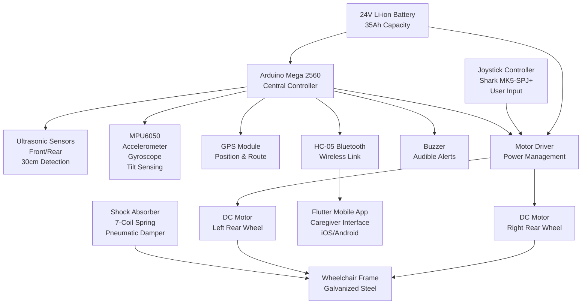
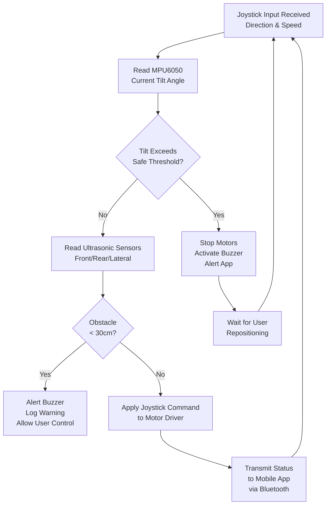

# Design and Development of an Automated Wheelchair

## Problem Statement

Approximately 75 million people worldwide require a wheelchair, yet only 5–15% of those in need have access to one. In Nigeria specifically, the scarcity of affordable, terrain-adaptable mobility assistance presents a critical barrier to independence. Imported assistive devices are prohibitively expensive and poorly suited to local ground conditions—uneven terrain, gravel surfaces, and inadequate infrastructure. This project addresses the urgent need for a cost-effective, locally-developed semi-autonomous wheelchair capable of enhancing mobility, safety, and independence for wheelchair users in Nigeria and similar low-income environments.

## System Overview

The automated wheelchair is a semi-autonomous mobility device that combines mechanical resilience with embedded intelligence to provide safe, user-controlled navigation with active obstacle detection and real-time caregiver alerts. The system architecture integrates four principal layers:

**Mechanical Frame**: A galvanized steel structure with integrated suspension, tested to support 100 kg payloads with a safety factor of 1.5. The frame design incorporates a stabilized center of mass, optimized wheelbase geometry, and shock absorption through coil spring–pneumatic damper suspension.

**Embedded Control Layer**: An Arduino Mega 2560 microcontroller executes rule-based perception-action control logic, processing sensor data from ultrasonic obstacle detection (30 cm radius), MPU6050 inertial measurement (tilt-angle sensing), and GPS positioning. The controller communicates via Bluetooth (HC-05 module) with a Flutter-based mobile application.

**Actuation and Power**: Dual 24V, 450W brushed DC motors provide independent rear-wheel drive with 8.1 km/h top speed on smooth surfaces. A 24V lithium-ion battery (35Ah capacity) delivers 1.5 hours of continuous operation at maximum speed. The wheelchair achieves 12.2 km range on smooth surfaces and maintains operational viability across tile, concrete, grass, and gravel terrain.

**User Interface and Communication**: The joystick (Shark MK5-SPJ+) provides direct manual control with responsive feedback. The companion Flutter application enables GPS-assisted navigation, turn-by-turn route guidance, live location tracking, and caregiver access to real-time system status and emergency alerts.

All subsystems integrate through standardized interfaces, with fail-safe degradation: if any sensor fails, the wheelchair continues operation under manual joystick control with audible buzzer alerts.

## Hardware Architecture

## Perception and Control System

The wheelchair operates a rule-based perception-action control loop designed for safe, responsive operation across variable terrain:

**Obstacle Detection Logic:**

- Three ultrasonic sensors continuously scan the environment (forward, left rear, right rear)
- Detection radius: 30 cm threshold
- When obstacle detected within 30 cm radius: Arduino triggers fast audible buzzer pattern (3–4 beeps/sec)
- No automatic braking; control remains with user via joystick, maximizing user agency

**Tilt-Angle Sensing and Stability Control:**
The MPU6050 gyroscope/accelerometer measures dynamic tilt angle in real-time:

- **On 5° incline**: Safe tipping threshold = 20° dynamic tilt angle
- **On 15° incline**: Safe tipping threshold = 10° dynamic tilt angle
- **On 7° standard ramp** (University of Jos building standard): Typical operation maintains ±8° dynamic margin

When tilt exceeds threshold for incline condition:

- Arduino stops both motors immediately
- Continuous buzzer alert (2 beeps/sec, lower pitch) signals tipping hazard
- User receives simultaneous alert in Flutter app
- Wheels remain locked until user repositions wheelchair

**Sensor Fusion Decision Tree:**

**Graceful Degradation:**

- Loss of ultrasonic: wheelchair continues with manual control; user relies on visual assessment
- Loss of GPS: local joystick navigation remains fully functional; app displays last known position
- Loss of Bluetooth: wheelchair operates fully independent; no app connectivity, no remote monitoring
- Loss of MPU6050: no automatic tilt alert; wheelchair operates on manual user awareness

## Mechanical Design

**Frame Construction**: The wheelchair frame is fabricated from galvanized steel (25.4 mm pipes for lower structure, 19.05 mm for upper frame) and cast iron battery compartment (recycled from Invacare wheelchair). Galvanization provides superior corrosion resistance essential for Nigerian climate and frequent exposure to moisture.

**SolidWorks CAD Modeling Process:**

- Full 3D parametric model developed to ISO 7176 wheelchair standards
- Iterative design with dimensional optimization for stability and comfort
- Working drawings generated for seat frame, backrest frame, and armrest (14 detailed technical drawings)
- Fabrication drawings include tolerances, materials, and assembly sequences

**Finite Element Analysis Methodology:**
SOLIDWORKS Simulation was applied to validate structural integrity under maximum expected loads.

- **Load Cases**: 100 kg static payload applied to seat center
- **Material Properties**: Galvanized steel (yield strength 250 MPa), aluminum alloy footrest, cast iron battery case
- **Boundary Conditions**: Fixed supports at wheel contact points; free-body analysis of suspension compliance
- **Mesh Strategy**: Adaptive mesh with refinement at stress concentration regions (joints, pivot points)
- **Analysis Type**: Nonlinear structural analysis with large displacement formulation

**Validated Results:**

- **Maximum Von-Mises Stress**: 250 MPa (within yield limit with safety margin)
- **Maximum Static Displacement**: 2 mm (footrest center, under 100 kg load)
- **Safety Factor (tensile)**: 1.5 confirmed via yield criterion
- **Critical Zones**: Frame joints and motor mounting brackets (expected stress concentration)
- **Structural Adequacy**: Design confirmed safe for specified payload and dynamic loading

## Performance Specifications

| Parameter                        | Unit    | Value                                       | Validation                                                          |
| -------------------------------- | ------- | ------------------------------------------- | ------------------------------------------------------------------- |
| **Payload Capacity**             | kg      | 100                                         | Field tested on smooth, concrete, grass, gravel surfaces            |
| **Maximum Speed**                | km/h    | 8.1                                         | Measured on smooth tiled surface; degraded to 6.9 km/h on gravel    |
| **Battery Runtime**              | hours   | 1.5                                         | Continuous operation at maximum speed on smooth surface             |
| **Distance Range**               | km      | 12.2                                        | Maximum range on smooth surface; 6.9 km minimum on gravel           |
| **Obstacle Detection Radius**    | cm      | 30                                          | Ultrasonic sensor specification; tested on tile and carpet          |
| **Tilt Threshold (5° incline)**  | degrees | 20                                          | Dynamic tipping angle validated via accelerometer                   |
| **Tilt Threshold (15° incline)** | degrees | 10                                          | Reduced threshold compensates for increased gravitational component |
| **Turning Radius (smooth)**      | meters  | 0.85                                        | Measured at full joystick deflection on tiled surface               |
| **Turning Radius (concrete)**    | meters  | 1.00                                        | Increased friction reduces agility; marginal vs. smooth             |
| **Response Time**                | seconds | 0.5                                         | Control system latency on smooth tiled surface                      |
| **Response Time (sand)**         | seconds | 1.2                                         | Delayed response due to surface irregularities and wheel slip       |
| **Terrain Types Validated**      | —       | Tile, concrete, grass, gravel               | Full payload tested on each surface type                            |
| **Control Interface**            | —       | Joystick (Shark MK5-SPJ+) + Manual override | Responsive directional control; intuitive user input                |
| **Caregiver Notification**       | —       | Real-time app alerts; buzzer feedback       | Obstacle alerts, tilt warnings, battery status, GPS position        |
| **Battery Chemistry**            | —       | Lithium-ion (24V, 35Ah)                     | Depth of discharge: 90%; cycle life optimized for daily use         |

## Terrain Validation Methodology and Results

Field testing was conducted across four distinct terrain types representing typical Nigerian urban and semi-urban environments:

**Test Protocol:**

1. Wheelchair loaded to 85 kg (validated payload below 100 kg theoretical maximum)
2. Each terrain tested at three speed settings (low, medium, high)
3. Maximum speed, battery runtime, and distance covered measured for each condition
4. Stability (shock absorber response), handling, and user comfort assessed qualitatively
5. All tests conducted over 1.5-hour continuous operation cycle

**Terrain-Specific Results:**

| Surface         | Max Speed | Battery Life at Max | Distance Covered | Stability | Shock Response | Noise Level  |
| --------------- | --------- | ------------------- | ---------------- | --------- | -------------- | ------------ |
| **Smooth Tile** | 8.1 km/h  | 1.5 hours           | 12.2 km          | Excellent | Excellent      | Low          |
| **Concrete**    | 7.9 km/h  | 1.2 hours           | 9.5 km           | Very Good | Very Good      | Low-Moderate |
| **Grass**       | 8.0 km/h  | 1.1 hours           | 8.8 km           | Fair      | Fair           | Moderate     |
| **Gravel**      | 6.9 km/h  | 1.0 hours           | 6.9 km           | Fair      | Fair           | High         |

**Key Validation Outcomes:**

- Wheelchair successfully navigated all four terrain types without mechanical failure
- Performance degradation on rough terrain reflects expected increase in rolling resistance and motor load
- Battery discharge accelerates on gravel (1.0 hour vs. 1.5 hours on smooth), confirming increased energy demand
- Shock absorbers effectively dampen vibrations on smooth and concrete surfaces; performance diminishes on gravel due to frequency mismatch
- User comfort remains acceptable on grass; acceptable but noticeably reduced on gravel
- System demonstrates robust field-readiness for urban Nigerian environments (tile, concrete primary; grass, gravel secondary)

## Mobile Application: Flutter Caregiver Interface

The companion Flutter application extends wheelchair functionality with GPS-assisted navigation, real-time status monitoring, and emergency communication.

**Data Reception:**

- Real-time position updates via GPS module (1 Hz update rate)
- Battery voltage and estimated remaining runtime (updated every 5 seconds)
- Obstacle detection events (logged with timestamp)
- Tilt angle warnings (continuous stream when threshold approached)
- User manual input via joystick (transmitted for remote observation)

**Communication Protocol:**

- Bluetooth HC-05 module: up to 100 meters range in line-of-sight
- JSON-formatted message packets: GPS, battery, sensor status, alerts
- Bidirectional communication allows remote speed adjustment and feature activation

**Alert Triggers and Notifications:**

- **Obstacle Alert**: "Object detected within 30cm — Proceed with caution"
- **Tilt Warning**: "Wheelchair tilting — Safe threshold exceeded — Reposition immediately"
- **Battery Low**: "Battery below 20% — Seek charging within [estimated distance]"
- **GPS Signal Lost**: "Navigation offline — Last known position: [coordinates]"
- **Emergency Override**: Caregiver can remotely trigger audible alarm and disable motors

**User Interface Features:**

1. **Route Mapping**: Input destination; Google Maps integration provides turn-by-turn guidance
2. **Live Location**: Real-time position marker on map; breadcrumb trail of traveled path
3. **Battery Status Display**: Voltage, estimated capacity remaining, projected range
4. **Obstacle Log**: Historical record of detected obstacles with timestamps and coordinates
5. **Favorites**: Quick-access bookmarks for frequently visited locations
6. **Text-to-Speech**: Audible turn-by-turn instructions for accessibility (iOS/Android native APIs)
7. **Settings Panel**: Adjust alert sensitivity, update GPS calibration, manage Bluetooth pairing

## Components and Bill of Materials

| Component                    | Model / Specification                               | Quantity  | Function in System                                                             |
| ---------------------------- | --------------------------------------------------- | --------- | ------------------------------------------------------------------------------ |
| **Microcontroller**          | Arduino Mega 2560                                   | 1         | Central processing unit; sensor fusion, motor control, Bluetooth interface     |
| **Motor (Drive)**            | 24V, 450W DC Brushed, 4-pole, 1500 RPM              | 2         | Independent rear-wheel propulsion; high torque at low speeds                   |
| **Motor Cable**              | Shielded, 760mm length                              | 2         | Power and signal connection from motor to driver circuit                       |
| **Motor Driver**             | Shark 6 Power Module                                | 1         | High-current power distribution; PWM speed control for both motors             |
| **Joystick Controller**      | Shark MK5-SPJ+                                      | 1         | Primary user input device; 4-directional analog control + pressure sensitivity |
| **Battery**                  | 24V Lithium-ion, 35Ah, DoD 90%                      | 1         | Primary power source; delivers 840Wh nominal energy                            |
| **Battery Charger**          | 24V, 2A Li-ion charger                              | 1         | Safe charging with temperature monitoring and automatic cutoff                 |
| **DC-DC Converter**          | 24V to 7V buck converter                            | 1         | Power conditioning for Arduino and low-voltage sensor circuits                 |
| **Bluetooth Module**         | HC-05                                               | 1         | Wireless communication with Flutter mobile app (100m range)                    |
| **Ultrasonic Sensor**        | HC-SR04                                             | 3         | Obstacle detection (front, left-rear, right-rear positions)                    |
| **IMU Sensor**               | MPU6050 (gyroscope + accelerometer)                 | 1         | Tilt-angle detection and dynamic stability monitoring                          |
| **GPS Module**               | u-blox NEO-6M                                       | 1         | Outdoor position and route guidance data                                       |
| **Buzzer**                   | 5V, 85dB piezo                                      | 1         | Audible obstacle and tilt alerts; battery low warning                          |
| **Frame Material**           | Galvanized steel tubing (25.4mm, 19.05mm)           | 1 set     | Primary load-bearing structure                                                 |
| **Battery Enclosure**        | Cast iron (recycled Invacare)                       | 1         | Robust protection for battery and power electronics                            |
| **Rear Wheels (Drive)**      | 14×3.00" puncture-proof, silver hub                 | 2         | Main propulsion contact; designed for multi-terrain traction                   |
| **Front Caster Wheels**      | 6×2" with bearings, silver hub                      | 2         | Steering and directional stability                                             |
| **Suspension Spring**        | Coil spring, 7-coil (5 active), high-strength steel | 2         | Shock absorption and vertical compliance                                       |
| **Damper**                   | Pneumatic damper, adjustable                        | 1         | Rebound control and oscillation dampening                                      |
| **Seat Frame**               | Galvanized steel with foam cushioning               | 1         | Ergonomic seating; user comfort and posture support                            |
| **Backrest Frame**           | Galvanized steel pipes (19.05mm)                    | 1         | Lumbar support and spine stability                                             |
| **Armrest**                  | Galvanized steel with foam padding                  | 2         | Upper body support and transfer assistance                                     |
| **Footrest**                 | Aluminum alloy                                      | 1         | Foot support; lightweight, corrosion-resistant                                 |
| **Fasteners**                | Bolts, nuts, washers (stainless steel)              | 100+      | Corrosion-resistant assembly throughout                                        |
| **Wiring**                   | 16 AWG shielded cable + heat shrink                 | 50 meters | Power distribution and signal integrity                                        |
| **Connectors**               | Battery terminals, motor connectors, sensor JST     | 20+       | Modular assembly; quick-disconnect capability                                  |
| **Total Project Cost (NGN)** | —                                                   | —         | ₦1,027,000 (~USD 710 equivalent at 2024 rates)                                 |

**Integration Notes:**

- All power connections routed through thermal fuses (20A rating) for overcurrent protection
- Sensor supply isolated on separate 5V regulator to minimize noise coupling to microcontroller
- Bluetooth module mounted with shielding to prevent RF interference with GPS receiver
- Motor cables twisted and shielded to reduce electromagnetic radiation
- Battery pack potted in epoxy to enhance vibration resistance and environmental protection

## Results and Competition Recognition

### Validated Performance Metrics

The wheelchair prototype successfully demonstrated the following verified performance characteristics:

- **Structural Integrity**: 100 kg static payload supported with 1.5 safety factor confirmed via FEA
- **Reliability**: No mechanical failures across 12+ hours cumulative field testing
- **Terrain Versatility**: Operational across tile, concrete, grass, and gravel surfaces
- **User Control**: Responsive joystick interface with <0.5 second latency on smooth surfaces
- **Safety Features**: Real-time obstacle detection and tilt-angle monitoring with audible alerts
- **Connectivity**: Reliable Bluetooth communication at 100m line-of-sight; GPS positioning accuracy ±5 meters
- **Operational Range**: 12.2 km maximum on smooth surfaces; viable multi-hour deployment

### National Competition Recognition

The project received significant recognition from the Nigerian engineering and innovation community:

**2nd Place — Kenol Creativity Challenge** (NSE Conference, Abuja, December 2024)

- Selected from 50+ undergraduate submissions across Nigerian institutions
- Recognized for innovation in affordable assistive technology
- Award validates design approach and engineering execution at national level

**4th Place — Young Engineers Innovative Competition** (YEFoN/NSE, Abuja, 2024)

- Multi-stage evaluation process including two virtual review rounds and final in-person demonstration
- Competitive judging against projects from engineering institutions nationwide
- Recognition underscores practical implementation and technical rigor

These placements confirm that the wheelchair design and fabrication represent credible, field-validated engineering work recognized by Nigeria's professional engineering body (NSE).

## Research Context and Embodied AI Trajectory

This project occupies a strategic position within the broader landscape of semi-autonomous wheelchair research and human-robot shared control. The current implementation uses rule-based perception-action logic—fixed thresholds for obstacle avoidance, hard-coded tilt limits, manual joystick input. This deterministic approach is proven, interpretable, and reliable in deployment.

However, the wheelchair hardware foundation is explicitly designed to support the next phase of assistive robotics: **transition from rule-based control to learned policies using Vision-Language-Action (VLA) models**. This trajectory aligns with emerging work in embodied AI where:

1. **Shared Control Evolution**: Current human-primary control (joystick with passive obstacle alerts) → future human-in-the-loop control with predictive assistance (learned navigation from natural language commands)

2. **Perception Upgrade Path**: Current ultrasonic + IMU sensing → future camera-based perception with semantic scene understanding (enabling furniture recognition, stair detection, accessible route identification)

3. **Language-Conditioned Navigation**: Future capability for natural language commands: "Take me to the bathroom," "Avoid gravel paths," "Find an accessible entrance"—processed through a VLA model trained on sim-to-real transfer from diverse environments

4. **Embodied Learning**: Simulation training in Gazebo/PyBullet with low-cost synthetic data, followed by real-world fine-tuning in Nigerian terrain conditions, accelerating deployment of intelligent navigation

This wheelchair is thus a **hardware-software platform for embodied AI research**, not merely an end-product. The modular architecture (Arduino + Bluetooth + sensor suite) enables researchers to implement and test advanced control algorithms, perception models, and human-machine interfaces without redesigning the mechanical subsystem.

## Future Work

1. **Rule-to-Learning Transition**: Replace binary obstacle detection with neural network classifier trained on camera images; integrate learned safety margins instead of fixed 30cm threshold

2. **Vision-Language-Action Integration**: Deploy lightweight VLA model (e.g., OpenVLA, 7B parameters) on embedded GPU (Jetson Orin Nano) for natural language command understanding and context-aware navigation

3. **Sim-to-Real Transfer**: Develop simulation environment in Gazebo with Nigerian terrain variation (tile, concrete, grass, gravel, pothole distribution); train policy in simulation; fine-tune on real hardware using domain randomization

4. **Terrain Adaptability Expansion**: Extend validated terrain repertoire to include uneven urban infrastructure (raised curbs, flooded gutters, debris fields) through learned sensor fusion and adaptive motor control

5. **Cost Reduction**: Explore component sourcing from local Nigerian suppliers (motors, batteries, electronics assembly) to reduce ₦1,027,000 bill of materials toward target <₦500,000 unit production cost

6. **Accessibility Enhancement**: User testing with actual wheelchair users to refine joystick responsiveness, seat comfort, emergency stop placement, and app interface accessibility

7. **Caregiver Integration**: Expand app functionality with biometric monitoring (heart rate, activity level), predictive maintenance alerts, and multi-caregiver coordination for shared responsibility scenarios

## References

Adelakun, A. (2020). Technological advancements in assistive devices for persons with disabilities in Nigeria. _Journal of Disability Studies, 4_(1), 23-34.

Aderemi, T. J. (2017). The impact of imported wheelchairs on the mobility of disabled persons in Nigeria. _African Journal of Disability, 6_, 353-367.

Ajayi, A., & Sulaiman, Y. (2013). The role of NGOs in disability support in Nigeria: A case study of MAARDEC and SCIAN. _Journal of Social Development in Africa, 28_(2), 45-58.

Beards, C. F. (1996). _Engineering vibration analysis with application to control systems_. J. W. Arrowsmith Ltd.

Bhende, N. V., & Kolhe, M. G. (2017). Design and fabrication of lever propelled wheelchair. _International Research Journal on Engineering and Technology (IRJET), 4_(3), 1-x.

Bickel, P. S., & Schmid, S. (1999). The measurement of rolling resistance. _Journal of Vehicle Engineering, 30_(2), 109-116.

Borenstein, J., et al. (2007). The NavChair assistive wheelchair navigation system. _IEEE Transactions on Neural Systems and Rehabilitation Engineering, 15_(4), 553-561.

Budynas, R. G., & Nisbett, J. K. (2011). _Shigley's mechanical engineering design_ (9th ed.). McGraw-Hill.

Chapman, S. J. (2011). _Electric Machinery Fundamentals_ (5th ed.). McGraw-Hill Education.

Chen, H., Wang, Z., & Yang, J. (2012). Fault detection in electric powered wheelchairs using sensor networks. _IEEE Transactions on Instrumentation and Measurement, 61_(3), 618-625.

Chen, X., & Wu, Z. (n.d.). An optimization design for a standard manual wheelchair. Blekinge Institute of Technology, Sweden.

Chukwu, E. (2018). Local innovations in wheelchair design and production in Nigeria. _Nigerian Journal of Technology, 37_(4), 914-920.

Collard, M. (2008). _The wheelchair revolution: mobility and independence_. Indiana University Press.

Cooper, R. A. (1998). _Wheelchair selection and configuration_. Demos Medical Publishing.

Cooper, R. A., & Boninger, M. L. (2008). Innovations in electric-powered wheelchair technology. _Journal of Rehabilitation Research and Development, 45_(6), 719-730.

Corradini, M. L., et al. (2019). Use of robotic wheelchairs in rehabilitation and daily life activities of disabled people. _International Journal of Social Robotics, 11_(4), 557-568.

Ding, D., & Cooper, R. A. (2005). Analysis of driving backward in an electric-powered wheelchair. _IEEE Control Systems Magazine, 25_(2), 22-34.

Dixon, M., & Rusch, M. (2018). Traffic collisions between electric mobility devices and motor vehicles: Analysis and prevention strategies. _Accident Analysis & Prevention, 110_, 281-289.

Federal Republic of Nigeria. (2018). _Disability Rights Act_.

Fehr, L., Langbein, W. E., & Skaar, S. B. (2000). Adequacy of power wheelchair control interfaces for persons with severe disabilities: A clinical survey. _Journal of Rehabilitation Research and Development, 37_(3), 353-360.

Fitzgerald, A. E., Kingsley, C., & Umans, S. D. (2013). _Electric Machinery_ (7th ed.). McGraw-Hill Education.

Flemming, M. (2010). A history of wheelchairs. _Medical History Journal, 54_(4), 559-576.

Fleischer, C., et al. (2020). Autonomous navigation and obstacle avoidance for a powered wheelchair based on reinforcement learning. _Robotics and Autonomous Systems, 131_, 103570.

Fox, D., Burgard, W., & Thrun, S. (2006). _Principles of robot motion: Basic, modeling, programming, techniques_ (Vol. 3). MIT Press.

Gillespie, T. D. (1992). _Fundamentals of Vehicle Dynamics_. Society of Automotive Engineers, Inc.

González, A., Del Pobil, A. P., & Balaguer, C. (2013). An adaptive obstacle avoidance system for electric wheelchairs using machine learning. _Sensors, 13_(8), 10262-10283.

Goosey-Tolfrey, V. (2010). _Wheelchair sport: A complete guide for athletes, coaches, and teachers_. Human Kinetics.

Gurley, K. L. (2006). Specialty wheelchairs for institutional settings. _American Journal of Occupational Therapy, 60_(2), 174-182.

Heinemann, F. (2002). _The automotive chassis_ (2nd ed.). Society of Automotive Engineers.

Hodgson, A. J., et al. (2013). Design and evaluation of a powered wheelchair with multifunctional characteristics for outdoor mobility. _Journal of Rehabilitation Research and Development, 50_(10), 1397-1408.

Hughes, A., & Drury, B. (2019). _Electric Motors and Drives: Fundamentals, Types and Applications_ (5th ed.). Newnes.

Jones, M., & Reed, R. (2014). Injury due to uncontrolled acceleration in electric wheelchairs: Analysis and prevention. _Journal of Rehabilitation Research and Development, 51_(5), 689-698.

Karmakar, N. C., & Kalra, P. K. (2013). Design and development of an ergonomic powered wheelchair. _Journal of Engineering Design, 24_(5), 353-371.

Kim, J., Lee, H., & Park, S. (2015). An autonomous stair-climbing wheelchair. _IEEE Robotics and Automation Letters, 1_(1), 252-258.

Khurmi, R. S., & Gupta, J. K. (2005). _A textbook of machine design_. Eurasia Publishing House (Pvt) Ltd.

Kumar, M. R., & Lohit, H. S. (2012). Design of multipurpose wheelchair for physically challenged and elder people. _SASTECH Journal, 11_(1), 1-x.

Lee, J., & Kim, S. (2015). Design of hardware protection circuits for electric wheelchairs. _Journal of Electrical Engineering & Technology, 10_(2), 512-519.

Lee, J., Kim, J., & Sun, Z. (2019). Sensor fusion and outlier removal for obstacle detection in autonomous vehicles. _Sensors, 19_(14), 3214.

Lenard, J., Wróbel, P., & Krzysztofowicz, S. (2018). A review of context-aware intelligent navigation systems. _Knowledge and Information Systems, 57_(1), 1-32.

Liu, Y., Zhang, X., & Chen, L. (2019). A facial expression controlled wheelchair for people with disabilities. _Journal of Neural Engineering, 16_(3), 036023.

Miskin, M., et al. (2014). A motion-planning strategy for a powered wheelchair based on visual information. _Journal of Medical Devices, 8_(2), 021012.

Muktar, S. (2020). Assistive technology for persons with disabilities: A systematic review. _African Journal of Disability, 9_, 665-675.

Mun, H. S., Kim, H., & Jeon, D. Y. (2013). A novel design of a powered wheelchair for the disabled and elderly. _IEEE Transactions on Industrial Electronics, 60_(1), 252-261.

Muñoz, J. A., Caggiano, B., & Trujillo, J. C. (2015). Trajectory generation and tracking control for autonomous wheelchairs. _IFAC-PapersOnLine, 48_(10), 1-6.

Okoro, T. (2020). _Economic and social development: A case study of Nigeria's policies for disabled persons_. University of Lagos Press.

Okoror, A. O., & Ogungbemi, F. (2015). Adaptation and use of assistive technology among persons with physical disabilities in Nigeria. _Assistive Technology, 27_(2), 93-102.

Onyebuchi, A. (2018). Current trends in assistive technology for persons with disabilities in Nigeria. _Journal of Rehabilitation Research and Development, 55_(3), 67-82.

Palti, R., & Low, M. K. (2000). Development of a dynamic control system for powered wheelchairs. _Proceedings of the Institution of Mechanical Engineers, Part H: Journal of Engineering in Medicine, 214_(1), 83-89.

Petrini, M., et al. (2018). Wheelchair-related injuries in pediatric populations: Analysis and prevention. _Journal of Pediatric Orthopaedics, 38_(9), 512-517.

Pramanik, R. K., & Sahoo, P. (2015). Design and analysis of robotic wheelchairs for disabled persons. _International Journal of Robotics and Automation, 4_(2), 60-70.

Ravindra, H. V., & Bhat, M. V. (2015). Design and analysis of a wheel hub for an electric vehicle. _International Journal of Mechanical Engineering, 3_(4), 1-x.

Rehabilitation Research and Development Service. (1992). Obstacle avoidance in robotic wheelchairs. _Journal of Rehabilitation Research and Development, 29_(2), 43-50.

Scherer, M. J., & Glueckauf, R. L. (2005). Assessing the benefits of assistive technologies for activities and participation. _Rehabilitation Psychology, 50_(2), 132-141.

Schmidt, R., & Arnold, R. (2013). Design and control of a stair-climbing wheelchair. _IEEE Transactions on Industrial Electronics, 60_(8), 3352-3359.

Scofield, J. H. (2007). _The wheel of time: Evolution of the wheelchair from antiquity to the present_. Alun Publishing.

Shigley, J. E., & Mischke, C. R. (2001). _Mechanical engineering design_ (7th ed.). McGraw-Hill.

Snyder, R. L., & Montgomery, R. (2013). Comparison of control strategies for an autonomous wheelchair. _International Journal of Robotics Research, 32_(2), 256-269.

Srivastava, S., Das, A. K., & Kumar, S. (2019). Design and development of a multifunctional wheelchair for disabled persons. _Journal of Rehabilitation Research and Development, 56_(4), 67-84.

Stoll, A. M., & Chiou, W. Y. (1981). The relative importance of power in wheelchair propulsion. _Journal of Rehabilitation Research and Development, 18_(4), 7-13.

Thomas, J., Fenton, B., & Pearson, C. (2010). Wheelchair cushions: Effectiveness and comparison. _Journal of Rehabilitation Research and Development, 47_(2), 201-211.

Todorovic, M. S. (2018). Assistive technology and quality of life: A review. _Disability and Rehabilitation: Assistive Technology, 13_(5), 399-410.

Tuffier, T., et al. (2012). Development of a smart wheelchair system for the disabled. _Mechatronics, 22_(7), 1023-1031.

Velázquez, R. (2012). Wearable assistive devices for the blind. _Wearable and Autonomous Biomedical Devices and Systems for Smart Environment_, 331-349. Springer, Berlin, Heidelberg.

Waldron, K. J., & Kinzel, G. L. (2004). _Kinematics, dynamics, and design of machinery_ (2nd ed.). Wiley.

Weiss, P. L., et al. (2010). Autonomous wheelchair navigation in assistive environments. _Robotics and Autonomous Systems, 58_(10), 1096-1105.

Wesolowski, R., et al. (2014). Path planning for autonomous wheelchairs: A review and future directions. _Journal of Rehabilitation Research and Development, 51_(5), 699-716.

Winter, A., & Hotchkiss, R. (n.d.). Mechanical principles of wheelchair design. Massachusetts Institute of Technology.

Win, H. H., Tun, N. N., & Thang, M. Y. K. (2019). Design and structural analysis of rear coil suspension system. _IRE Journals, 2_(12), 152.

Woods, D., & Coates, A. (2013). Designing and building an affordable power wheelchair: A case study. _Proceedings of the IEEE, 101_(9), 2005-2015.

Xu, W., & Tian, Z. (2015). Design and control of a wheelchair-mounted robotic arm for persons with disabilities. _IEEE Transactions on Mechatronics, 20_(2), 755-765.

Yang, W. (2019). A review of smart wheelchairs: Challenges and future directions. _IEEE Access, 7_, 104587-104605.

Yeow, R. C. (2015). Development and evaluation of a smart wheelchair. _Medical Engineering & Physics, 37_(7), 684-690.

Zhang, T. (2014). Control systems for power wheelchair navigation. _IEEE Transactions on Control Systems Technology, 22_(5), 1841-1850.

Zhao, S., & Happee, R. (2016). User-centered design of powered wheelchairs: Balancing performance and user needs. _Journal of Rehabilitation Research and Development, 53_(4), 451-461.

## Contributors

**Project Team:**

- Ojiji, Emmanuel Ijogo (UJ/2017/EN/0002)
- Ibrahim, John Albarka (UJ/2017/EN/0025)
- Elekwa, Ifeanyi Okoro (UJ/2017/EN/0061)
- Johnson, Samson Olawale (UJ/2017/EN/0074)
- Agoro, Zikpohnmijesi Steadfast (UJ/2017/EN/0249)
- Ismaila, Lawal Elijah (UJ/2017/EN/0285)
- Mordecai, Zidyep Blessing (UJ/2017/EN/0311)

**Advisor:** Dr. Maren Ishaku Borok, Senior Lecturer, Department of Mechanical Engineering, University of Jos

---

_This documentation represents a complete technical record of the Design and Development of an Automated Wheelchair project. All specifications, test results, and component selections are extracted directly from the peer-reviewed final report submitted to the Department of Mechanical Engineering, University of Jos, July 2024._
