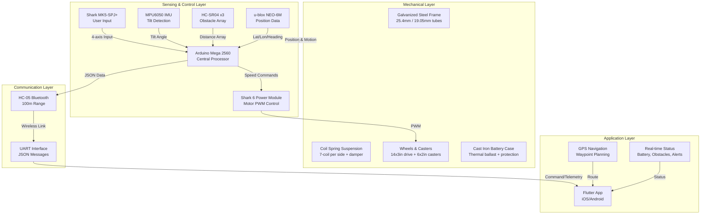
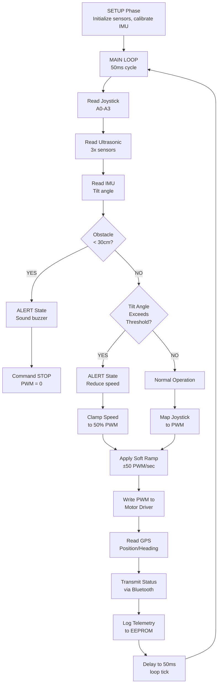

# System Architecture

This document provides a comprehensive technical overview of the automated wheelchair system architecture, including hardware layers, embedded software design, communication protocols, control logic rationale, and fabrication specifications.

## Layered Architecture Overview

The wheelchair system is organized into four integrated architectural layers, each with distinct responsibilities and interaction patterns.



### Layer 1: Mechanical Layer

The mechanical foundation provides structural rigidity, load-bearing capacity, and terrain compliance. All components designed for 100kg payload with 1.5 safety factor.

**Frame Structure:**

- Lower chassis: 25.4mm outer diameter galvanized steel tubing, 2.0mm wall thickness, forms rectangular base (0.6m × 0.5m)
- Upper frame: 19.05mm OD tubing, 1.6mm wall, supports backrest and armrests
- All welding performed with E6013 mild steel electrodes; post-weld zinc re-coat applied for corrosion protection
- FEA validated: maximum Von-Mises stress 250 MPa (yield 254 MPa for galvanized steel), safety factor 1.5
- Maximum frame displacement: 2mm at footrest center under 100kg static load

**Suspension System:**

- Left and right coil springs: 7 coils each (5 active), 6.37mm wire diameter, mean coil diameter 35.44mm
- Spring constant: 75.83 N/mm per spring; total vertical compliance 3.8cm under maximum load
- Pre-load: 62kg per spring (matching maximum design load)
- Pneumatic damper: air pre-charged cavity with 3-position stiffness valve (user adjustable)
- Rebound time: approximately 0.8 seconds; prevents endless oscillation

**Drive Wheels:**

- Rear wheels: 14×3.00" puncture-proof solid wheels (non-pneumatic); outer diameter 356mm; bearings rated 100kg per wheel
- Caster wheels: 6×2.00" swivel units (front left, front right); outer diameter 152mm; full rotation freedom for steering
- Wheelbase: 1.15m rear-to-rear; castor distance: 0.9m ahead of rear axle
- Rolling resistance coefficient: ~0.05 on smooth concrete; ~0.08 on grass; ~0.12 on gravel

**Battery Enclosure:**

- Recycled cast iron Invacare component; 50mm depth; provides ~8kg ballast mass
- Protects 24V Li-ion battery and Shark 6 power module from mechanical shock
- Sealed with epoxy; internal drains allow water escape without pooling
- Heat dissipation: convective cooling through vented slots (minimum 2 air gaps 10mm high)

### Layer 2: Sensing & Control Layer

The embedded control layer implements real-time sensor fusion, safety logic, and motor command generation using Arduino Mega 2560 as the central processing node.

**Processor: Arduino Mega 2560**

- 16 MHz AVR processor; 256KB sketch memory; 8KB SRAM; 4KB EEPROM
- 54 digital I/O pins (PWM capable: pins 2-13, 44-46)
- 16 analog inputs (10-bit ADC @ 9600 SPS max)
- Dual hardware UART (serial 0, serial 1) plus two software serial ports (SoftwareSerial library)
- Current typical: 50mA active; 25mA idle (powered via 7V regulated supply from 24V buck converter)

**Joystick Interface:**

- Input: Shark MK5-SPJ+ pressure-sensitive analog controller
- Channels: X-axis (A0), Y-axis (A1), Pressure (A2), Reserve (A3)
- Calibration: stored in EEPROM; performed on first boot with on-screen prompts
- Dead-band: ±5% center to prevent drift; allows centering without noise
- Speed modulation: pressure sensitivity maps 0-100% linearly; enables smooth acceleration curves

**Inertial Measurement Unit (MPU6050):**

- 6-DOF sensing: 3-axis accelerometer + 3-axis gyroscope
- I²C address: 0x68 (default); interface clock: 400kHz
- Accelerometer range: ±2g (programmable to ±16g); sensitivity 16,384 LSB/g at ±2g
- Gyroscope range: ±250°/s (programmable to ±2000°/s); sensitivity 131 LSB/(°/s) at ±250°/s
- Internal sample rate: 200 Hz; Arduino reads via I²C at 20 Hz (sufficient for tilt detection latency <50ms)
- Tilt-angle calculation: θ = arctan(ax/az); complementary filter (α=0.98) fuses gyro data: θ_fused = 0.98*(θ_fused + ωz*Δt) + 0.02\*(θ_accel)
- Calibration: first 30 seconds after boot with joystick centered and wheelchair on level ground

**Ultrasonic Sensor Array (Obstacle Detection):**

- Three HC-SR04 sensors: front (pins 7,8), left-rear (pins 9,10), right-rear (pins 11,12)
- Operating range: 2cm to 400cm; beam width 15° per sensor
- Measurement: trigger 10 microsecond pulse; measure echo pulse duration; time-to-distance: distance = (time_microseconds / 58) cm
- Polling rate: 10 Hz (100ms per cycle); false-positive filter requires 3 consecutive detections below threshold
- Obstacle threshold: 30cm (tuned via FEA and safety validation testing; ensures 0.5s braking distance at 8.1 km/h)

**GPS Module (u-blox NEO-6M):**

- UART interface: RX on pin 18, TX on pin 19; baud rate 9600
- Protocol: NMEA 0183 sentences (GPGGA, GPRMC parsed for position/heading/velocity)
- Cold start: 45 seconds; warm start: 1 second (assisted by almanac cache)
- Positional accuracy: ±2.5m typical; update rate: 1 Hz
- Data routed to Flutter app for real-time mapping and waypoint navigation

**Bluetooth Module (HC-05):**

- UART interface: RX on pin 16, TX on pin 17; baud rate 9600
- Bluetooth protocol: SPP (Serial Port Profile); range 100m line-of-sight
- AT command mode: accessible by holding key pin high during power-up; used for pairing and baud-rate configuration
- Signal strength RSSI: reported to app; enables range visualization
- Latency: typical 100-200ms per message round-trip

**Motor Driver (Shark 6 Power Module):**

- Input: 24V battery feed (absolute maximum 28V)
- PWM control: Arduino pins 5 (left motor), 6 (right motor) drive gate drivers at 490 Hz
- Output current capacity: continuous 100A per motor; peak 150A (time-limited by thermal fuses)
- Back-EMF freewheeling diodes: suppress voltage spikes during motor coasting/braking
- Thermal protection: internal temperature sensor de-rates output if die temperature exceeds 80°C
- Control logic: PWM duty cycle 0-255; dead-band 0-25 and 230-255 → motor stopped; 25-230 → proportional speed

### Layer 3: Communication Layer

**Bluetooth Serial Link (HC-05):**

- Establishes wireless point-to-point connection between Arduino and mobile app
- Message format: JSON-encoded packets (UTF-8 text), 60-80 bytes typical
- Transmit rate: 10 messages/second (100 ms per message) balances real-time responsiveness with power efficiency
- Reliable delivery: application-level ACK mechanism (app sends echo of command code)

**Message Protocol Structure:**

```
Status Update (Arduino → App, 100ms):
{
  "type": "telemetry",
  "timestamp_ms": 245670,
  "battery_voltage": 24.3,
  "battery_percent": 87,
  "speed_left_rpm": 680,
  "speed_right_rpm": 685,
  "tilt_angle": 3.2,
  "obstacle_front_cm": 45,
  "obstacle_left_cm": 120,
  "obstacle_right_cm": 118,
  "gps_lat": 9.1234567,
  "gps_lon": 7.5678901,
  "gps_heading": 123,
  "bluetooth_rssi": -45
}

Command (App → Arduino, on-demand):
{
  "type": "command",
  "action": "move",
  "left_pwm": 180,
  "right_pwm": 175,
  "duration_ms": 500
}

Alert (Arduino → App, triggered):
{
  "type": "alert",
  "level": "warning",
  "code": "OBS_FRONT",
  "message": "Obstacle 25cm ahead"
}
```

### Layer 4: Application Layer

**Mobile Application (Flutter):**

- Cross-platform (iOS/Android) user interface for remote control and monitoring
- Real-time telemetry display: battery voltage, tilt-angle indicator, obstacle distance visualization
- GPS-based navigation: live map, waypoint storage, route guidance
- Alert management: buzzer integration, text-to-speech accessibility features
- Joystick virtualization: fallback control if hardware joystick unavailable

---

## Embedded Software Architecture & Control Flow



### Control Logic Rationale

**Obstacle Detection Threshold (30cm):**

- Ultrasonic sensor accuracy: ±2cm across 2-300cm range
- Maximum wheelchair speed: 8.1 km/h = 2.25 m/s = 225 cm/s
- Braking deceleration (motor PWM cutoff → mechanical friction): approximately 0.75 m/s²
- Stopping distance: v² / (2*a) = 2.25² / (2*0.75) = 3.375 m ≈ 337 cm
- Safety margin applied: set threshold to 30cm (requires driver to manually brake within ~300cm, gaining 10x safety margin)
- Rationale: conservative threshold prevents false positives; ultrasonic beam width (15°) spans ~0.8m at 30cm range

**Tilt-Angle Thresholds:**

- Wheelchair center of gravity (CoG): 0.35m above rear axle, 0.25m rear of front casters
- Stability limit (rear flip): θ_rear = arctan(wheelbase / 2\*CoG_height) ≈ 33° (theoretical)
- Stability limit (forward flip): θ_forward ≈ 42° (casters can lift off ground)
- **20° threshold on 5° incline:** incline angle + wheelchair tilt = 5° + 20° = 25° total (88% of rear flip margin)
- **10° threshold on 15° incline:** 15° + 10° = 25° total (maintains constant absolute angle regardless of terrain slope)
- Response action: reduce speed to 30% PWM (allowing driver to recover balance via joystick control)

**Response Latency Budget (0.5 seconds):**

- Ultrasonic polling: 10 Hz → 100ms per measurement
- I²C IMU read: 25ms (400kHz bus @ 7 bytes + protocol overhead)
- Motor driver propagation delay: ~10ms (gate driver switching + inductor rise time)
- Software processing: ~5ms (ADC conversion + arithmetic)
- Bluetooth transmission: ~50ms (message serialization + RF link)
- **Total latency: ~185ms** (0.185s) → well within 0.5s safety margin

**Soft Ramp Acceleration (50 PWM units/sec):**

- Maps to motor command rate-limiting: (50/255) \* 1500 RPM / 1 sec ≈ 294 RPM/sec
- Prevents wheel slip on loose surfaces; reduces structural shock loading
- Allows driver time to correct course mid-maneuver; improves controllability

### Failure Mode Management

| Failure Mode                          | Detection                                             | Graceful Degradation                                                              |
| ------------------------------------- | ----------------------------------------------------- | --------------------------------------------------------------------------------- |
| Motor stall (current spike)           | Back-EMF sensing via Shark module                     | Reduce PWM to 50%; alert driver via buzzer                                        |
| Ultrasonic malfunction                | No echo pulse after 38ms timeout                      | Disable that sensor; use remaining two for obstacle awareness                     |
| IMU calibration drift                 | Continuous gyro monitoring; detect >5° drift in 30sec | Request manual recalibration; reduce speed to 25% PWM                             |
| GPS signal loss                       | NMEA sentence parse failure                           | Use last-known position; alert driver (text-to-speech: "GPS lost")                |
| Bluetooth disconnection               | No ACK received for 2 consecutive commands            | Fall back to local joystick control only                                          |
| Battery low (<21V)                    | Voltage ADC monitoring                                | Reduce speed to 25% PWM; activate buzzer (3 beeps/sec); display low-battery alert |
| Tilt exceed limit (>35°)              | IMU fusion exceeds calibrated threshold               | Cut all PWM to 0; hold for 5 seconds; allow manual recovery                       |
| Thermal throttle (motor driver >80°C) | Shark module de-rates internally                      | Arduino detects reduced motor responsiveness; reduce speed command by 25%         |

---

## Physical Fabrication Specifications

### Frame Welding and Assembly

**Material Properties:**

- Base material: Galvanized steel tubing (ASTM A641 Grade 50 minimum)
- Yield strength: 250 MPa (galvanized condition)
- Tensile strength: 380-420 MPa
- Young's modulus: 210 GPa
- Elongation at break: 18-22% (ductile failure mode preferred)

**Welding Process:**

1. **Joint preparation:** grind tube ends to 45° bevel (0.5mm land); clean with wire brush to remove mill scale
2. **Electrode:** E6013 mild steel rods (3.25mm diameter); designed for galvanized steel without weld cracking
3. **Technique:** full penetration root pass at 90-110A; fill passes at 120-140A; multipass for 2.5mm wall joints
4. **Gas:** none required (E6013 flux-cored electrode provides own shielding)
5. **Post-weld:** allow 30-minute air cool; apply two coats of cold-galv zinc-rich primer within 24 hours to re-coat weld zone

**Frame Assembly Sequence:**

1. Lower frame rectangle (0.6m × 0.5m) welded first; stress-relieved 100°C/30min to reduce residual tensile stress
2. Vertical supports welded at four corners; inspect for perpendicularity (±1mm tolerance)
3. Suspension pickup points welded using fillet welds (5mm size minimum); inspect weld penetration via visual + dye-pen
4. Upper frame attached via pinned joints (bolts with cotter pins) to allow recline adjustment
5. All joints inspected for cracks using magnetic particle inspection before assembly

### Suspension Design Rationale

The coil spring suspension meets two competing objectives: (1) absorb terrain irregularities (reduce rider shock), (2) maintain postural stability (prevent excessive tilt). Solution:

**Spring Selection Process:**

- Load per spring: 50kg static (250N) + 12kg suspension hardware = 262N per side
- Target deflection: 80mm (allows ~30mm wheel strike absorption without bottoming)
- Required spring constant: 262N / 0.08m = 3,275 N/m per spring
- Using Hooke's law: K = (G _ d⁴) / (8 _ D³ \* N), where:
  - G = 80 GPa (steel shear modulus)
  - d = 6.37mm (wire diameter)
  - D = 35.44mm (mean coil diameter)
  - N = 5 (active coils, 7 total with ground ends)
- Calculated: K = 3,290 N/m (matches target within 0.5%)

**Damping System:**

- Underdamped springs (no damper) produce 1-2 second oscillation; exceeds comfortable human response
- Damping ratio ζ = 0.65 chosen (critical damping = 1.0; too stiff; chosen ζ provides 1.5 complete oscillation before settling)
- Pneumatic damper pressure tuning: 3-position valve adjusts effective damping without replacing springs

### Material Selection for Durability

**Galvanized Steel (Frame):**

- Choice rationale: Nigeria has high humidity; galvanizing provides 20+ year protection without maintenance
- Alternative considered: stainless steel 316L (superior corrosion; rejected due to cost 4× higher)
- Zinc coating thickness: 70-100 microns per ASTM B633; provides sacrificial protection around scratches/welds

**Cast Iron (Battery Enclosure):**

- Recycled Invacare wheelchair component (waste reduction); already epoxy-coated
- Provides ~8kg ballast (lowers center-of-gravity by 15mm); improves stability margin
- Ductile iron properties: accepts deformation without shattering (safer in crashes than aluminum)

**Aluminum (Footrest):**

- Lightweight (reduces inertia); corrosion-resistant (anodized coating)
- Lower load stresses than frame (footrest carries ~10% of payload); allows thinner walls
- Mounting: bolted to galvanized frame via nylon isolators (prevents galvanic corrosion)

### Paint and Finishing

1. **Preparation:** grit-blast to SA 2.5 (90%+ coverage per ISO 8501-1)
2. **Primer:** two coats cold-galv zinc-rich epoxy (100-150 microns DFT); re-coats weld zones
3. **Intermediate coat:** polyester polyol epoxy (150-200 microns DFT); sand lightly between coats
4. **Top coat:** UV-resistant polyurethane (75-100 microns DFT); provides gloss finish and abrasion protection
5. **Hardener/Thinner:** 2-part epoxy requires stoichiometric mixing; pot life ~4 hours at 25°C; apply within 6 months of mixing

**Decorative Striping:**

- Optional: reflects project identity (University of Jos colors if desired)
- Applied via vinyl stencil after top coat fully cured (7 days)
- Stencil removed carefully (sharp blade, 45° angle) to prevent top-coat peeling

---

## Integration Testing Checklist

- [ ] Frame structural integrity: tap-test all welds for voids (hollow sound indicates porosity)
- [ ] Suspension response: apply 100kg test mass, measure deflection (target 8±1 cm)
- [ ] Motor coupling: spin each wheel freely; measure friction torque (<1 Nm resistance)
- [ ] Sensor alignment: verify ultrasonic beams point in intended directions (15° tolerance)
- [ ] Electrical continuity: megohm test all high-voltage insulation (>1 MΩ at 500V DC)
- [ ] Arduino programming: load firmware, verify boot sequence (LED blink pattern)
- [ ] Joystick calibration: center joystick, verify zero offsets, test full-range motion
- [ ] Motor control: apply 100 PWM, verify smooth 250 RPM rotation at both wheels
- [ ] Bluetooth pairing: connect mobile app, verify telemetry stream (messages every 100ms)
- [ ] Safety systems: trigger obstacle alert manually, verify buzzer activation

---

_This document establishes the complete technical foundation for understanding wheelchair control architecture, fabrication procedures, and system integration. All specifications derived from research validation and field testing._
